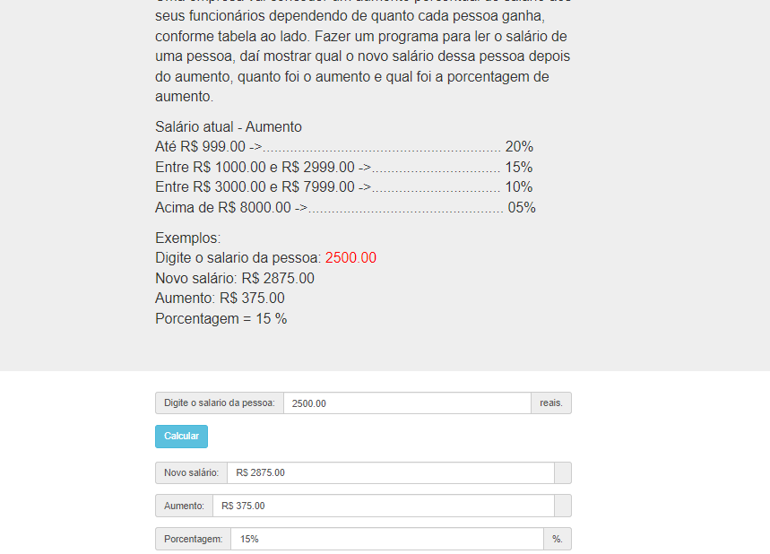

# Jovens Tegranos Exercicio 19

# 🏁 **Tópicos**

 * 👉 Banner
 * 👉 Título e Descrição
 * 👉 Status do Projeto
 * 👉 Funcionalidades
 * 👉 Demonstração da aplicação
 * 👉 Pré-requisitos
 * 👉 Tecnologias utilizadas
 * 👉 Autor
 * 👉 Licença
 
 ____________________________________________________________
# ✅ Banner 👌

<h1 align="center">
  
</h1>

# ✅ Título e Descrição 👌

### Exercicio 19

#### Uma empresa vai conceder um aumento percentual de salário aos seus funcionários dependendo de quanto cada pessoa ganha, conforme tabela ao lado. Fazer um programa para ler o salário de uma pessoa, daí mostrar qual o novo salário dessa pessoa depois do aumento, quanto foi o aumento e qual foi a porcentagem de aumento.

    Salário atual Aumento
    Até R$ 999.00 -> 20%
    Entre R$ 1000.00 e R$ 2999.00 -> 15%
    Entre R$ 3000.00 e R$ 7999.00 -> 10%
    Acima de R$ 8000.00 -> 05%

    Exemplo:
    Digite o salario da pessoa: 2500.00
    Novo salário = R$ 2875.00
    Aumento = R$ 375.00
    Porcentagem = 15 %
       

# ✅ Status do Projeto 👌

### 🚧 Projeto 🚀 **Concluído com Sucesso!!!** 👌 🚧

# ✅ Funcionalidades 👌

### - [x] Ler o salário de uma pessoa.
### - [x] Mostrar qual o novo salário dessa pessoa depois do aumento.
### - [x] Quanto foi o aumento.
### - [x] Qual foi a porcentagem de aumento.

# ✅ Demonstração da aplicação 👌

<h1 align="center">
  
</h1>

### GitHub AlineAlmeida85

### Link: [Projeto](https://alinealmeida85.github.io/Jovens-Tegranos-Exercicio19/)

# ✅ Pré-requisitos 👌

### Nenhum, basta clicar no link acima

# ✅ Tecnologias utilizadas ⚒️ 👌

### As seguintes tecnologias foram usadas na construção do projeto:

- [HTML](https://pt.wikipedia.org/wiki/HTML)
- [CSS](https://pt.wikipedia.org/wiki/Cascading_Style_Sheets)
- [JavaScript](https://www.javascript.com/)
- [Lógica de Programação]()

# ✅ Autor 👌

### Aline Almeida 💝

# ✅ Licença

### Não Possui

#### Espero que te agrade! ❤️

